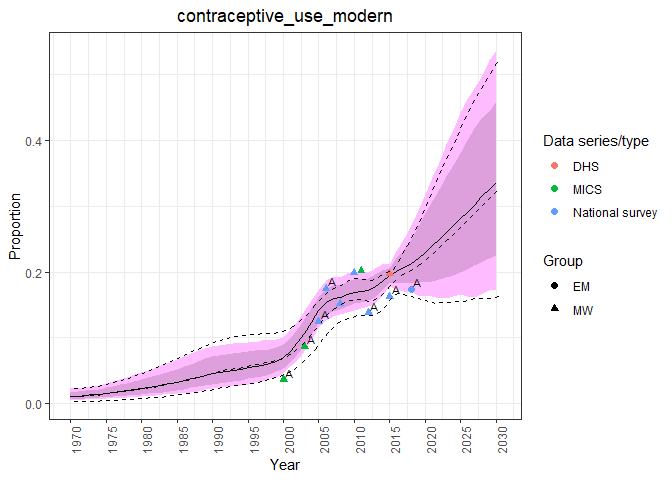
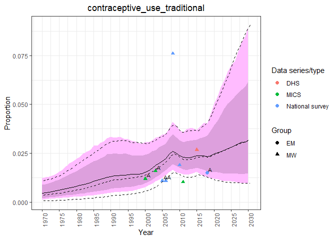

FPEMcountry
================

<!-- ## Table of Contents -->

<!-- 1. [Introduction](#intro) -->

<!-- 2. [Run models](#run) -->

<!-- 3. [Post-process](#post-process) -->

<!-- 4. [Plot model results](#plot) -->

## Installation

The package can be installed by cloning and using `devtools::install()`.
The source code for vignettes can be found in
[/vignettes](https://github.com/FPcounts/FPEMcountry/tree/master/vignettes).
Below is a brief introduction.

## Introduction

The FPEMcountry package is the one-country implementation of FPEM
(family planning estimation model) designed with tidyverse philosophy.
The model in this package uses global model results from the package
FPEMglobal to aid in the estimation of country level family planning
indicators. FPEMcountry comes equiped with survey data, country unit
data, and country population count data, to produce one-country runs.
Running FPEM is divided into three main wrapper functions.

1.  Run a one country model `fpem_one_country`
2.  Calculate point estimates for indicators `fpem_results`
3.  Plot the point estimates against the survey data `fpem_plot`

These three functions make running one country FPEM straightforward,
while retaining enough division to carry out a variety of developer and
client tasks. In this document we will cover the typical use of these
three functions.

To start a run we need to know the country code for the country of
interest. Our package contains country codes and other country units in
the dataset `divisions`.

``` r
divisions
```

    ## # A tibble: 232 x 13
    ##    division_numeri~ name_country name_region name_sub_region region_numeric_~
    ##               <dbl> <chr>        <chr>       <chr>                      <dbl>
    ##  1                4 Afghanistan  Asia        South-Central ~              935
    ##  2                8 Albania      Europe      Southern Europe              908
    ##  3               12 Algeria      Africa      Northern Africa              903
    ##  4               16 American Sa~ Oceania     Polynesia                    909
    ##  5               20 Andorra      Europe      Southern Europe              908
    ##  6               24 Angola       Africa      Middle Africa                903
    ##  7              660 Anguilla     Latin Amer~ Caribbean                    904
    ##  8               28 Antigua and~ Latin Amer~ Caribbean                    904
    ##  9               32 Argentina    Latin Amer~ South America                904
    ## 10               51 Armenia      Asia        Western Asia                 935
    ## # ... with 222 more rows, and 8 more variables: sub_region_numeric_code <dbl>,
    ## #   is_developed_region <chr>, is_less_developed_region <chr>,
    ## #   is_least_developed_country <chr>, is_in_sub_saharan_africa <chr>,
    ## #   is_unmarried_sexual_activity <chr>, is_low_population <chr>,
    ## #   is_fp2020 <chr>

Our package data sets are tibbles. This is particularly useful for large
datasets because it only prints the first few rows. The country codes
used by our package, known as `division_numeric_code`, are found in this
data. In our example we will execute a one-country run for Afghanistan,
code `4`. Survey data is available in the dataset `contraceptive_use`.
See `??contraceptive_use` for a detailed description of this dataset.

``` r
contraceptive_use %>% dplyr::filter(division_numeric_code == 4)
```

    ## # A tibble: 12 x 31
    ##    division_numeri~ start_date end_date is_in_union age_range data_series_type
    ##               <dbl>      <dbl>    <dbl> <chr>       <chr>     <chr>           
    ##  1                4      1972     1975. Y           15-49     National survey 
    ##  2                4      2003.    2004. Y           15-49     MICS            
    ##  3                4      2000.    2001. Y           15-49     MICS            
    ##  4                4      2005.    2006. Y           15-49     National survey 
    ##  5                4      2007.    2007. Y           15-49     National survey 
    ##  6                4      2008.    2009. Y           15-49     National survey 
    ##  7                4      2011.    2011. Y           15-49     MICS            
    ##  8                4      2010.    2011. Y           15-49     National survey 
    ##  9                4      2015.    2016. Y           15-49     DHS             
    ## 10                4      2015.    2016. Y           15-49     National survey 
    ## 11                4      2013.    2013. Y           15-49     National survey 
    ## 12                4      2018.    2019. Y           15-49     National survey 
    ## # ... with 25 more variables: group_type_relative_to_baseline <chr>,
    ## #   contraceptive_use_modern <dbl>, contraceptive_use_traditional <dbl>,
    ## #   contraceptive_use_any <dbl>, unmet_need_modern <lgl>, unmet_need_any <dbl>,
    ## #   is_pertaining_to_methods_used_since_last_pregnancy <chr>,
    ## #   pertaining_to_methods_used_since_last_pregnancy_reason <lgl>,
    ## #   has_geographical_region_bias <chr>, geographical_region_bias_reason <chr>,
    ## #   has_non_pregnant_and_other_positive_biases <chr>,
    ## #   non_pregnant_and_other_positive_biases_reason <chr>, age_group_bias <chr>,
    ## #   modern_method_bias <chr>, has_traditional_method_bias <chr>,
    ## #   traditional_method_bias_reason <chr>,
    ## #   has_absence_of_probing_questions_bias <chr>, se_modern <dbl>,
    ## #   se_traditional <dbl>, se_unmet_need <dbl>, se_log_r_modern_no_use <dbl>,
    ## #   se_log_r_traditional_no_use <dbl>, se_log_r_unmet_no_need <dbl>,
    ## #   source_id <dbl>, record_id <chr>

## <a name="run"></a>

## Run models

`fpem_one_country` is a wrapper function to run the family planning
estimation model. The argument `is_in_union` specifies which model we
wish to run. There are two models, one for in-union and another for
not-in-union women. These are indicated with `"Y"` and `"N"`
respectively. The first\_year and last\_year arguments determine the
years of estimates exported from the run. Regardless of these arguments,
the function will use all years in which data is available for
estimation. When a survey file is not provided, as in this example, the
function uses default package contraceptive\_use. The user may also
supply optional services statistics.

``` r
div <- 4
runlist <- fpem_one_country(
  is_in_union = "Y",
  division_numeric_code = div,
  first_year = 1970,
  last_year = 2030,
  diagnostic = TRUE
)
```

`fpem_one_country` returns a list runs. In this case we have one run,
in-union women denoted `$y`. This run contain posterior samples and
another list called `core_data`. Core data contains processed survey
data and run specific data such as the time frame, union, etc.

``` r
runlist$y$core_data %>% names
```

    ## NULL

## Process the samples

`fpem_results` is a wrapper function for calculating point estimates and
confidence intervals. By default the function uses package population
data (See `population_counts`) in order to calculate family planning
indicators. Custom population count data may be supplied (See
`??fpem_get_results`).

`fpem_results` utilizes `pmap` from the tidyverse package purr allowing
it to act on any number of runs. We will supply the entire list of runs
from `fpem_one_country`.

``` r
results <- fpem_results(runlist)
```

Like the previous function, `fpem_results` returns a list of runs. Each
run containing a list of tibbles. Each tibble contains point-estimates
for a specific family planning indicators in long-format. Selecting the
in-union run from the output of `fpem_results` we can inspect the names
of the list which are the family planning indicators.

``` r
results$y %>% names
```

    ## NULL

Let’s take a look at the tibble for the indicator
`contraceptive_use_modern`

``` r
results$y$contraceptive_use_modern
```

    ## NULL

## Plot the results

`fpem_get_plots` plots the results of the model against the survey data.
The user supplies the objects exported from `fpem_one_country` and
`fpem_results` as well as indicators of interest. Indicators of interest
are supplied to the argument `indicators`. The argument
`compare_to_global` adds point estimate and 95% credible interval from
the UNPD global model (See `global_estimates`). The global model
estimates are plotted using dotted lines. Since we are only using the
default data from UNPD the estimates from our model should align with
the UNPD estimates.

``` r
fpem_plot(
  runlist,
  results,
  indicators = c(
    "unmet_need_any",
    "contraceptive_use_modern",
    "contraceptive_use_traditional",
    "contraceptive_use_any"
    ),
  compare_to_global = TRUE
  )
```

    ## Joining, by = "year"
    ## Joining, by = "year"
    ## Joining, by = "year"

    ## $run
    ## $run[[1]]

<!-- -->

    ## 
    ## $run[[2]]

<!-- -->

    ## 
    ## $run[[3]]

<!-- -->

    ## 
    ## $run[[4]]

<!-- -->
