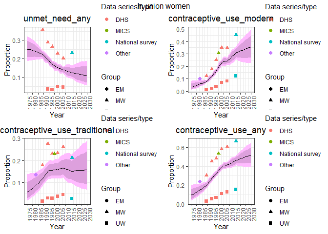

FPEM
================

## Table of Contents

1.  [Introduction](#intro)
2.  [Run models](#run)
3.  [Post-process](#post-process)
4.  [Plot model results](#plot)

## <a name="intro"></a>

## Introduction

FPEM is composed of the following micro-packages
[fpemdata](https://github.com/FPRgroup/fpemdata),
[fpemmodeling](https://github.com/FPRgroup/fpemmodeling), and
[fpemreporting](https://github.com/FPRgroup/fpemreporting). The
micropackages can be installed by cloning and using
`devtools::install()`. The source code for vignettes can be found in
[/vignettes](https://github.com/FPRgroup/FPEM/tree/greg/vignettes).
Knitted versions of vignettes can be found in
[/docs](https://github.com/FPRgroup/FPEM/tree/greg/docs). The directory
[/design](https://github.com/FPRgroup/FPEM/tree/greg/design) contains
technical details about the design of this project for pacakge
maintainers and contibutors. Below is a brief introduction to the FPEM
packages.

## <a name="run"></a>

## Run models

`fpemmodeling::do_1country_run` is a wrapper function to run the family
planning estimation model for a coutnry of interest for either married
or unmarried women. When a survey file is not provided (as in this
example) the function uses default data from
`fpemdata::contraceptive_use`. The function takes in additional inputs
such as services statistics if desired. See
`??fpemdata::service_stats`for required service statistic data format.
See `??fpemmodeling::do_1country_run` for all possible inputs to this
wrapper function. If you wish to obtain results for all women
`fpemmodeling::posterior_samples_all_women` can be used after completing
a run for married women and a run for unmarried women. See
[FPEM/vignettes](https://github.com/FPRgroup/FPEM/vignettes) for more
details

``` r
run_y <- fpemmodeling::do_1country_run(
  is_in_union = "Y",
  surveydata_filepath = NULL,
  service_stats = FALSE,
  division_numeric_code = 400,
  first_year = 1975,
  last_year = 2010
)
```

## <a name="post-process"></a>

## Process the samples

`fpemreporting::fpem_calculate_results` returns point-estimates for
several indicators in long-format.

``` r
population_counts <- fpemdata::population_counts %>%
  dplyr::filter(division_numeric_code == run_y$core_data$units$division_numeric_code) %>%
  dplyr::filter(is_in_union == "Y")
results_y <- fpemreporting::fpem_calculate_results(
  posterior_samples = run_y$posterior_samples,
  country_population_counts = population_counts,
  first_year = 1975 #min(run_y$core_data$year_sequence_list$result_seq_years)
)
```

## <a name="plot"></a>

## Plot the results

`fpemreporting::fpem_plot_country_results` plots the results of the
model againts the observations. Choose any indicators returned from
`fpemreporting::fpem_calculate_results`

``` r
indicators <- c(
    "unmet_need_any",
    "contraceptive_use_modern",
    "contraceptive_use_traditional",
    "contraceptive_use_any"
    )
plots <- fpemreporting::fpem_plot_country_results(
  country_results = results_y,
  observations = run_y$core_data$observations,
  first_year = 1970,
  last_year = 2020,
  is_in_union = "Y",
  indicators = indicators
  )
gridExtra::grid.arrange(grobs=plots[1:length(indicators)],
                 ncol=2,
                 top="In-union women")
```

<!-- -->
